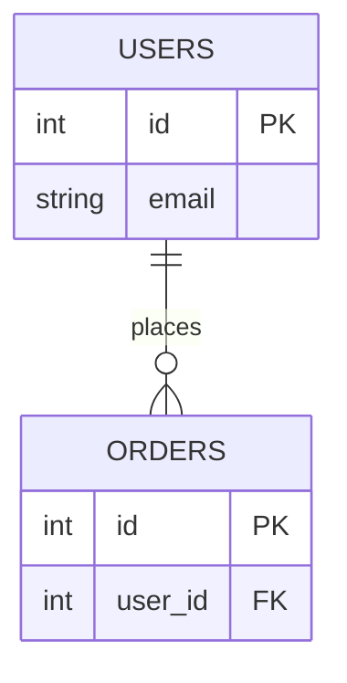

# ERD Generator

Turn a domain description into a validated Mermaid ERD and a rendered SVG.

## Workflow

1. **Parse the requirements.** Identify the entities, the primary key (PK) of each entity, the foreign keys (FK), and the cardinalities between entities. Use a join entity for many-to-many relationships.

2. **Write the Mermaid syntax** directly to `docs/architecture/schema.mmd`. The first line must be `erDiagram`. Example:



3. **Execute the render script** from the repository root:

```bash
   node .agent/skills/erd-generator/scripts/render_erd.js docs/architecture/schema.mmd
```

   This is the skill's `scripts/render_erd.js`. It must be run from the repository root so the output lands in `docs/architecture/erd.svg`.

4. **Self-correction loop.** If the output starts with `SYNTAX_ERROR`, read the error trace, adjust the Mermaid syntax in `docs/architecture/schema.mmd`, and run the script again. Retry up to 3 times. If it still fails after 3 retries, stop and report the last error to the user.

5. **Final output.** Present the raw Mermaid block to the user in a fenced `mermaid` code block, and reference the generated image at `docs/architecture/erd.svg`.